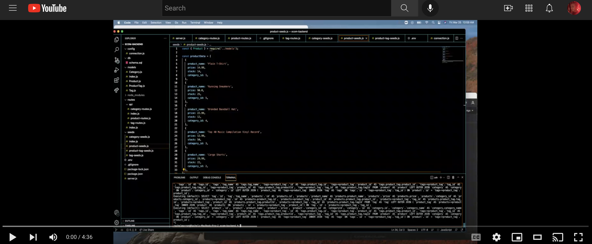
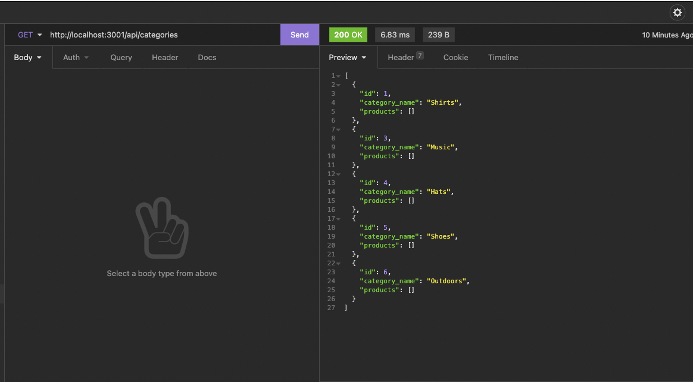
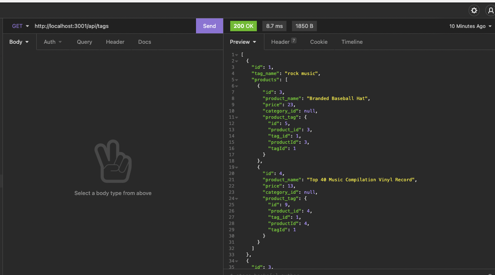
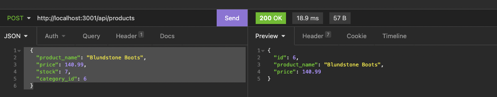
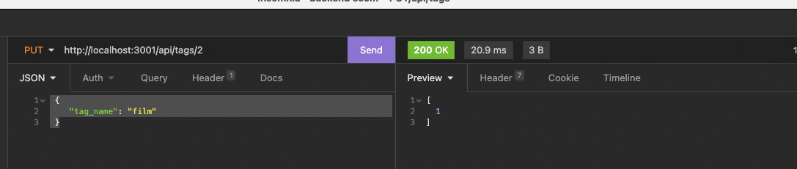
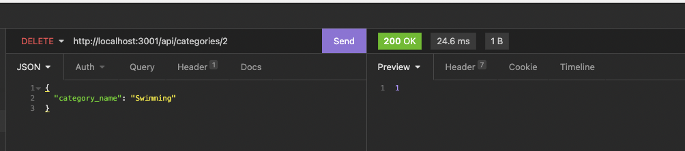

# E-commerce Backend

## Link to deployed application 
Video Walkthrough: <a href="https://youtu.be/uhdjtqeUZAk">https://youtu.be/uhdjtqeUZAk</a>

## Overview 
I built a back-end application for an e-commerce site. Using starter code, MySQL, and Express.js API, this application uses sequelize to communicate with and make changes to the SQL database. 

## Summary of My Task & User Story 
This assigment had a user story of: AS A manager at an internet retail company 
I WANT a back end for my e-commerce website that uses the latest technologies
SO THAT my company can compete with other e-commerce companies

The Acceptance Criteria included: 
<ul><li>GIVEN a functional Express.js API</li>
<li>WHEN I add my database name, MySQL username, and MySQL password to an environment variable file</li>
<li>THEN I am able to connect to a database using Sequelize</li>
<li>WHEN I enter schema and seed commands</li>
<li>THEN a development database is created and is seeded with test data</li>
<li>WHEN I enter the command to invoke the application</li>
<li>THEN my server is started and the Sequelize models are synced to the MySQL database</li>
<li>WHEN I open API GET routes in Insomnia for categories, products, or tags</li>
<li>THEN the data for each of these routes is displayed in a formatted JSON</li>
<li>WHEN I test API POST, PUT, and DELETE routes in Insomnia</li>
<li>THEN I am able to successfully create, update, and delete data in my database</li></ul>

## How This Was Acheived
<ul>
<li>Using schema.sql, I created and used the ecommerce_db. I ran npm run seed through the command line where the product, tag, and category data was seeded into their corresponding tables.</li>
<li>I created a .env file that housed sensitive information</li>
<li>I created routes where users can look up all products, categories, or tags, or view a single one by ID. I also created put and delete requests so users can add, delete or replace across all 3 data types.</li>
  </ul>

## Visual Representation 

GET Requests:  
  
  
 

 POST Request: 
 

 PUT Request: 
 

 DELETE Request: 
 

## Contributors

- Special thanks to my tutor, Chris Baird for helping me with the server and .env file complications

## License

This application is covered under MIT License    

- - -

© 2021 Rachel Delaney Marron, Inc. All Rights Reserved.
